# *Lab1 - Getting started on Watson Studio Hands-On*
---

In this first Lab, we will start getting to grips with **IBM Watson Studio** projects, services, data assets, and run our first **Jupyter Notebook.**

# [A]. Setup
Watson Studio is an IBM Cloud service, so in addition to the IBM Cloud account setup, you will need to create the Watson Studio instance. In addition, Watson Studio makes use of additional data and AI related services from the IBM Cloud platform, so we will create some artifacts for use within Watson Studio at runtime. 
1. Create a Watson Studio service instance
1. Create a Watson Studio Project for the workshop.
1. Provision a set of additional services
1. Load data files into the project as Data Assets

## [A.1]. Getting started with data exploration and notebooks
Once the Watson Studio project is completed, we can start our data related work
1. Quick assesment of the contents of a Data Asset
2. Work with Jupyter notebooks

The source material for the Workshop is held in a Box folder at URL  https://ibm.box.com/v/WatsonStudio-WS

## [A.2]. Creating a Watson Studio instance
From IBM Cloud, we will instanciate a Watson Studio service, as the anchor for the toolset within IBM Cloud. Note that this is a one-time setup, only one instance of Watson Studio per region needs to be created.
1. Log-in to you IBM Cloud account's dashboard (at https://console.bluemix.net/dashboard/apps)
2. Click the `[Create Resource]` button at the top right 
3. In the search filter field, add the single word `studio`. This should reveal the lite services having the `studio` word in their name. 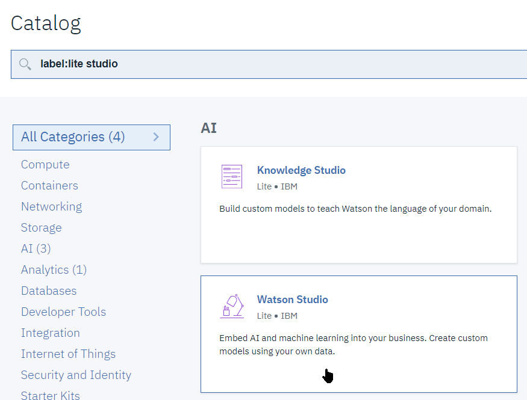 and click the `Watson Studio` tile.   
> NOTE: Make sure to use **`Watson Studio`**, and ***not*** *`Knowledge Studio`*
4. You are taken to the service creation page. Although it is possible to create an instance of Watson Studio in either `US South` or `United Kingdom` regions, it is recommended to use `US South` because this is where services, including new beta ones are updated first. You can change the service name suffix or keep the suggested name. Keep the `Lite` service plan and click the `[Create]` button.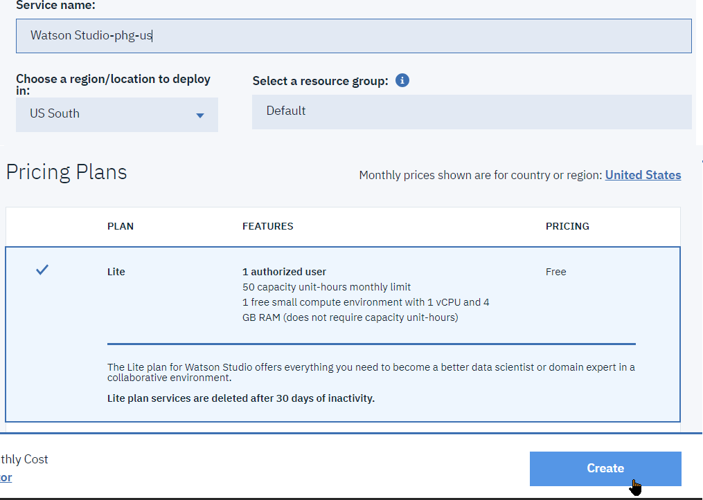

NOTE: In the rest of the labs, if you created your Waston Studio instance in the `US-South` region, you will need to use the plain URLs without prefix, e.g. `dataplatform.ibm.com`, but if you created in the `United Kingdom` region, you will need to use the `eu-gb` URLs, e.g. `eu-gb.dataplatform.ibm.com`.

## [A.3]. Creating a Watson Studio project
Now that we have put in place the infrastructure to work with Data & AI, we can start creating a project for a specific data handling project.
1. If not already signed-in, login to your Watson Studio environment within IBM Data Platform. For this, go back to the IBM Cloud dashboard, select the `Watson Studio` service instance, and click the '[Get Started]' button 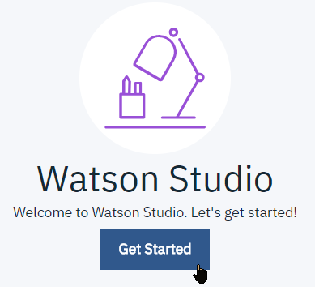.  
The first time you start the Watson Studio UI, you will be asked to confirm some details, click the `[Continue]` button: 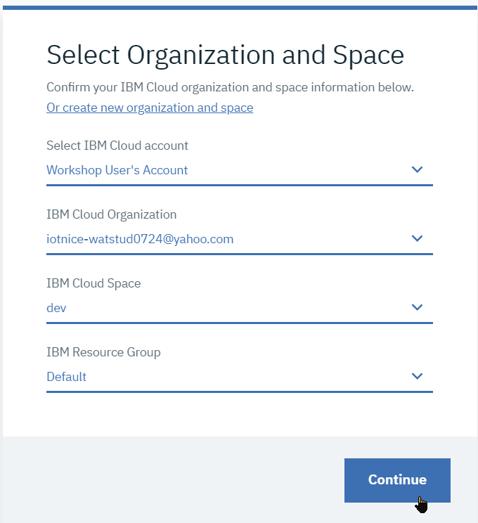, and then validate    
Note that you can also go directly to the service's Cloud Web UI using the URL for the region where the service has been created, either https://dataplatform.ibm.com/projects?context=analytics for 'US-South' or https://eu-gb.dataplatform.ibm.com/projects?context=analytics for 'United Kingdom'
Create a new project using the `Create a Project` button tile 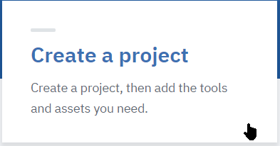    
Then select a `Standard` configuration. This governs which tools are made available to the project, and can be altered later if need be 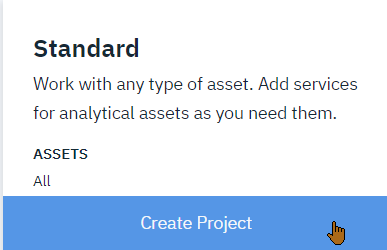
   
Validate with the `[OK]` button
1. Name this new project e.g. `WatStud_Workshop`.   
Note that you will want to leave the 'Restrict who can be a collaborator' unchecked, it will make sharing the project with another account more straightforward.   
Watson Studio stores its file-like artifacts into an instance of `Cloud Object Storage`, we will create a COS service instance at this stage:
   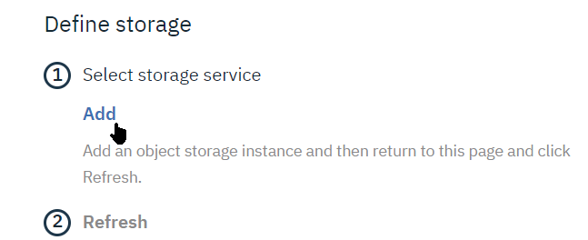
   > Currently, your only choice is **IBM Cloud Object Storage**. Information stored with **IBM Cloud Object Storage** is encrypted, resilient and dispersed across multiple geographic locations, and accessed over HTTP using a REST API.  
   Each project and catalog has its own dedicated bucket.
   1. Select the Lite Plan 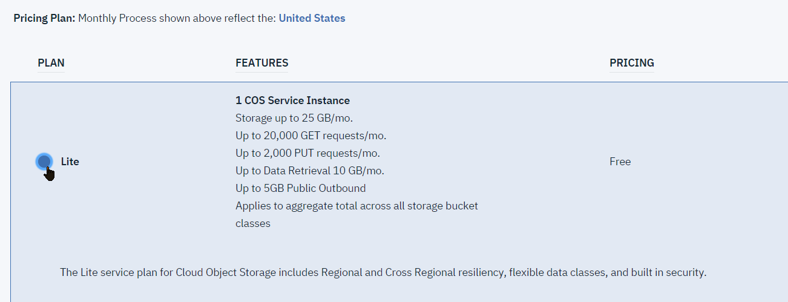
   1. Accept the default names for resource group and Service name
   1. Back to the Project creation page, select Refresh then the new Object Storage service instance
   1. Finally, click **Create**:
   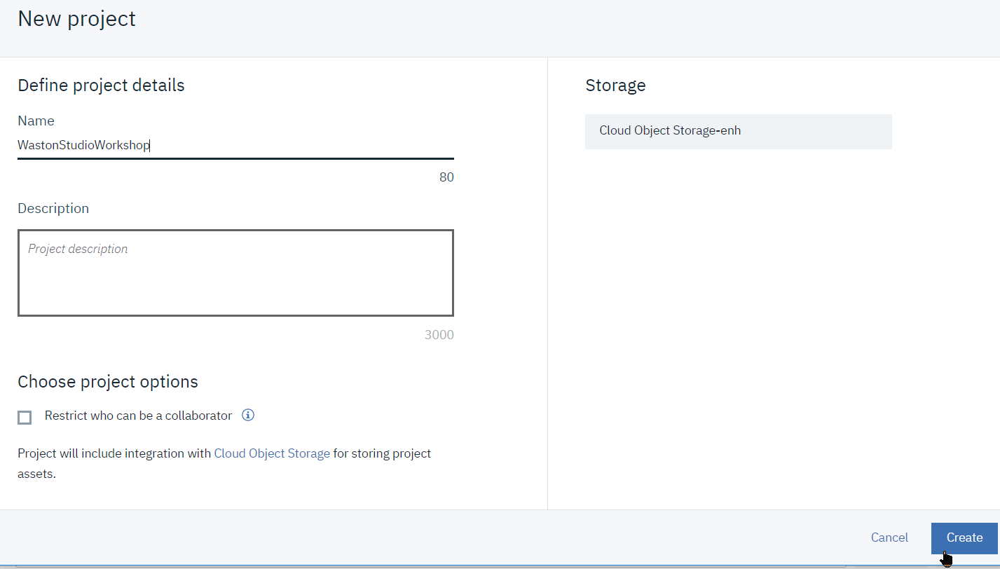
Note that COS instance needs to be created only once, it will hold projects' artifacts in separate buckets for each.

## [A.4]. Loading Data Assets for the project
We will load some of the files used during the Hands-On lab as Data Assets available to your project.   
The files are available in the Box folder.
1. In your **IBM Watson Studio** project, switch to the `Assets` tab:
2. Initially the Data Assets list should be empty. If not opened yet, open the Data Pane by selecting the `1001` icon at top right: 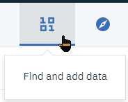
3. Select the `Load` tab 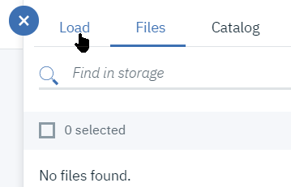
4. Click Browse to add files that you will have downloaded to your computer's disk from the Box folder.   
Among the files that we will need, you can start loading the following ones:
The source data for these files can also be found at their original location on the web.   

|File name|Original location
|---|---
|`GoSales_Tx.csv`|https://dataplatform.cloud.ibm.com/exchange/public/entry/view/ba9a3008817bbf458eea4980294e618b
|`cars.csv`|https://dataplatform.cloud.ibm.com/api/exchange/actions/download-dataset/c81e9be8daf6941023b9dc86f303053b
|`201701-citibike-tripdata.csv`|https://www.citibikenyc.com/system-data
5. Once done, the files will show up in the `Data assets` list.

## [A bis]. Project collaboration (optional)
One of the strengths of **IBM Watson Studio** is to allow to easily collaborate on shared projects.    
If you have for example another **IBM Cloud** account, you can add that other account as a collaborator on this `WatStud_Workshop` project:   
(Or you can share this with your class neighbour)

* Select the `Add new collaborator` button 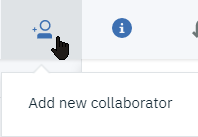  
* Enter the e-mail address of another account 
* Select an access level, Admin will allow full control, the click `Add`
* The new collaborator shows up in the summary 
* Finally click `Invite` to validate the change
* If you login with another account to IBM Cloud and another user's instance of Watson Studio, you will be abe to access this project too.

## [A.5]. Quick assessment of the Data Asset
You can quickly browse through sample from one of the Data Assets, so as to get an idea of the data format.

For example:
1. From the `Assets` tab in the project page, select the `cars.csv` data asset by clicking on it
2. This opens a preview of the data in tabular format. Data set has 9 columns and 406 rows.
> Note that you can change the Data Asset metadata such as the **Description** and the **Tags** from the **Information** side bar and clicking on the **pencil** to go in edit mode.


3. Now select the `Refine` button   
This will open the Data Refinery tools of **IBM Watson Studio** which allows to cleanse and shape data, customize it by filtering, sorting, combining or removing columns, and performing operations.  
NOTE: If the `[Refine]` button is not present or grayed-out, navigate to the `Tools/Data Refinery` menu 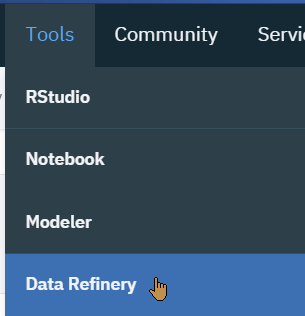, then select your project 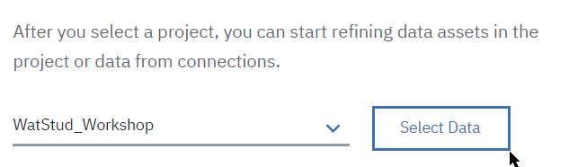, and finally `[Add]` the intended file.
> As you manipulate your data, you build a customized data refinery flow that you can modify in real time and save for future re-use. When you save the refined data set, you typically load it to a different location than where you read it from. In this way, your source data can remain untouched by the refinement process.

4. switch to the `Vizualisations` tab in the view that opens 
5. in COLUMNS TO VISUALIZE, enter `mpg`, then `(+) Add column` and `horsepower`. Then select a graph type of `Scatterplot`
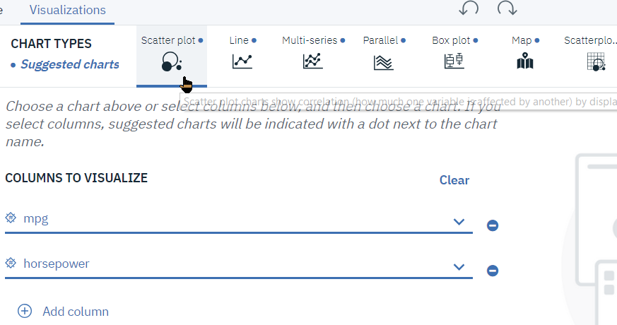 
6. the graph plots the two data columns to show their relationship. We will see in the Visualization Hands-On Lab how to programatically generate a similar graph.
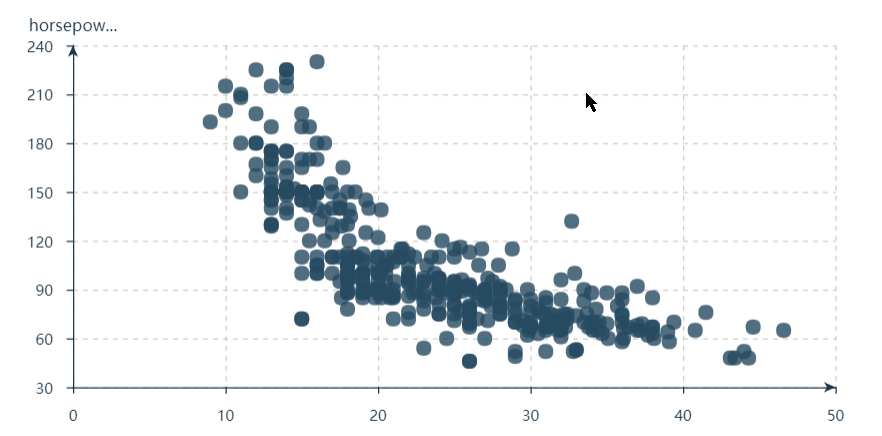
7. On the left panel, you can modify the coloring of the dots according to `acceleration` , and their color according to number of `cylinders`: 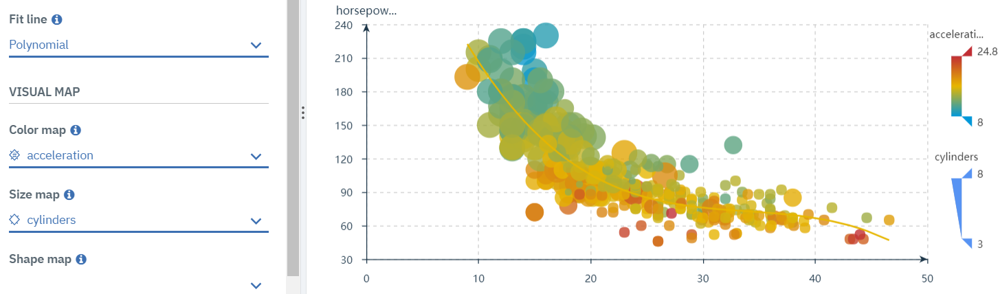
8. Finally, notice that the legend gauges on the right side are active and allow to filter the represented dataset, here we show only 2-4 cylinder cars: 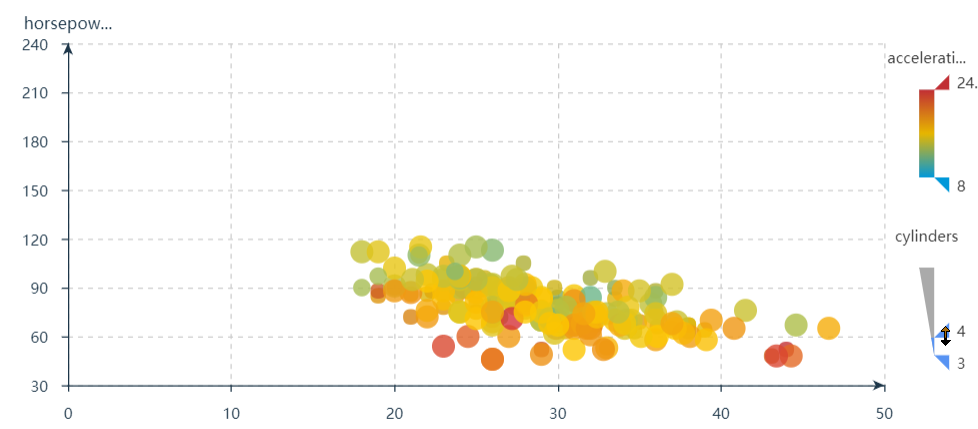

### Interpretation of the horsepower/mpg scatter plot
Scatter plots are very useful diagrams to quickly show if there is a relationship between two atributes.   
Here we see that there is a general trend that cars with higher horsepower tend to have lower miles-per-gallon. This is kind of an expected outcome.   
But we also see that the curve is not quite a straight line, it looks more hyperbolic.   
Moreover, some points are clearly not on the general trend, these are called **'outliers'**. You can hover at the point at `{hp: 132, mpg: 32.7}`, or `{hp: 15, mpg: 72}` for example.   

# [B] Data Refinery
The Data Refinery in **IBM Watson Studio** is an integrated ETL feature which allows to easily implement data transformation pipelines in  the form of a sequence of data operations applied to a data set called **data flows**.

In this section, we will use Data Refinery to cleanse and filter the contents of the `201701-citibike-tripdata.csv` data file.   
This file is one of the monthly reports of bike sharing usage for NYC, provided as an Open Data asset from https://www.citibikenyc.com/system-data.   
We will use **IBM Watson Studio** to get a first understanding of the data, and apply some transformations to reduce the volume and scope of data to analyze.
Note that this file is pretty large, with over 725000 lines of data, and a raw file size of over 120MB, in CSV format, which is not the most efficient to store data (the zipped content is about one fifth of the raw data)

1. From your project's `Assets` tab, locate `201701-citibike-tripdata.csv` and select the `Refine` contextual menu option: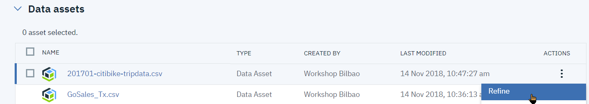.   
    > You may also launch Data refinery from the Tools menu, in which case you will need to select the `201701-citibike-tripdata.csv` data file, and click the `[Add]` button at the bottom right, if it is not active, you will have to select `[Add]` from the main panel.
1. Data Refinery will show a table with the 1000 first rows as a sample. As part of the operations we will want to apply to the data, we will:
    1. Rename the columns so as to remove blanks that could cause handling issues later on
    2. Specify actual data types for non-string fields. This applies to the numeric `Trip Duration`, `Birth Year` and the 4 station *latitude* and *longitude* columns. 
    3. Compute an Age column from `Birth Year`.
    4. Extract date and time slot columns from the Start and Stop time columns.

    > Notice that as you perform data transformations, the steps of your data flow are added on the right side bar.   
## [B.1]. Columns renaming:
1. For the first column, select the `+ Operation`  button, then the `Rename`  operation, and replace the column name by the same with spaces replaced by underscores, e.g. `Trip Duration` becomes `Trip_Duration`.  
>NOTE that it's a good idea to cut the column name before clicking the `Next` button so as to save retyping it.   

2. For the other columns, there is a faster way to add a rename operation, by clicking the **pencil** icon in the column header and changing the name there:  
 

As you proceed through columns renaming, you will see operations being listed in the right-hand side panel. You should now have 14 operations listed in the steps list: .
 **Save** you work with the Disk icon.     

## [B.2]. Data type changes
1. Now add `Convert Column type` operations for `Trip_Duration` and `Birth_Year` columns: . 
1. Select `Integer` as the target type. Leave the `Create new column` unselected: 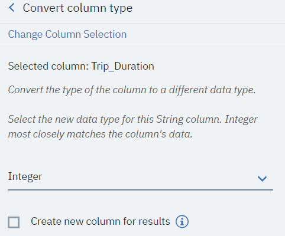  
You can add the operation either from the `[+ Operation]` button at the top left, or from the column's header context menu: 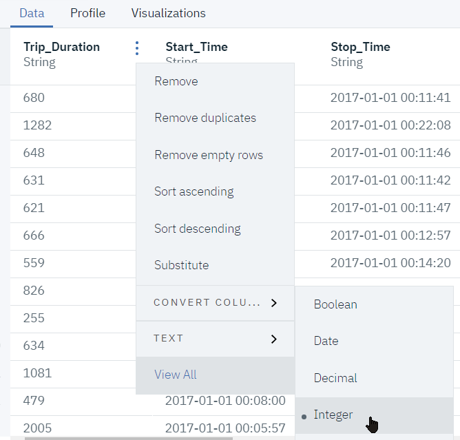. Note in this case how the `Integer` type is suggested with a small blue dot at its left.
1. Do the same for the 4 Start/End Latitude and Longitude columns, using `Decimal` as the type: 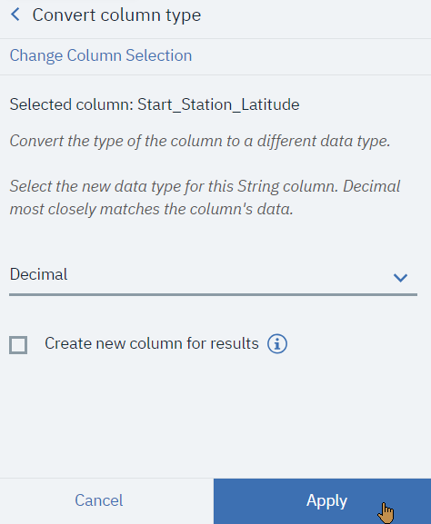. Also note the suggested `Decimal` type here.
You should now have 20 steps recorded.

## [B.3]. Feature Engineering: Additional computed column
We will compute the age from the birth year. Since we have only the birth year, we will just use 2017 as the reference year from which to substract the birth and get an approximate age.   
We will also remove all rows where `Age` is missing.
1. Add a `Calculate` operation, select `Birth_Year` as column, `Substraction` as operation, and `value` 2017.
1. Check the `Create new column for result` checkbox and enter `Age` as the new column name: 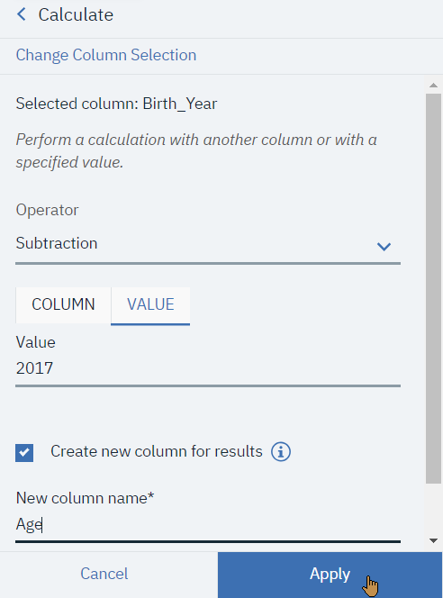
1. The compute age comes out negative, we will add a `Math` / `Absolute Value` operation to the `Age` column: 

> Note that at each step, you can see a preview of the data in the table.
Verify that the values for `Age` column seem correct in the preview.

Also note that here we've used the UI-driven point-and-click style column ETL operations. It is also possible to add column operations using the guided formula operations entry at the top of the table preview.   
For the age extraction operation, you could have entered a formula such as:
```
mutate(Age = 2017 - Birth_Year)
```


## [B.4]. Feature Engineering: Process the timestamp columns
Finally, we will process the time fields. We will convert the date&time string format to a `Timestamp` type. We will then extract the `Date` into a new separate column, then the `Hour` slot from the timestamp into a new column typed `Integer`. For each of the `Start/Stop_Time` columns:

1. Select `Convert Column` to `Timestamp`: 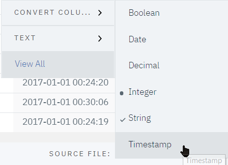
   Make sure to select `ymdhms` as the format, and do not create a new column: 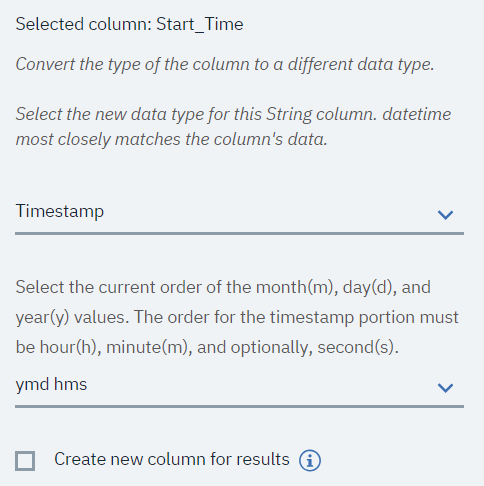
1. Extract the Date, using the `Extract date or time value` operation: 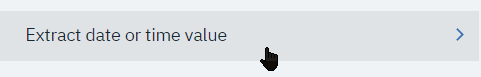,
   then `Date` and make sure to create new `Start/Stop_Date` columns: 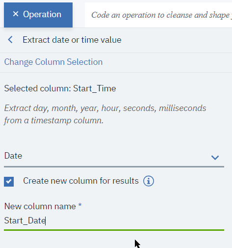
1. Repeat the operation to add new `Start/End_Hour` colunms

You should now have 28 steps defined.   
**Save** your flow.

## [B.5]. Data Cleansing: remove columns with no Birth_Date
Some columns are missing the Birth_Year demographics information. We will remove the rows that have this field empty.   
Note that we could (and maybe should) have added this step before computing the Age column.

1. From the `Birth_Year` column header context menu, select the `Remove empty rows` operation: 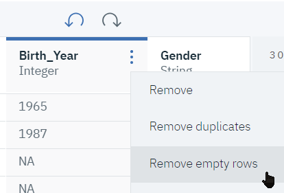

You should now have 29 steps defined.

## [B.6]. Apply Data Flow pipeline to the input files
We will now process the entire file with our data cleansing and feature engineering pipeline.   

1. Click on the 'Run' icon at the top right: 
1. Change the output target file name to e.g.  `201701-citibike-tripdata_cleansed.csv`, and use format as `CSV` 
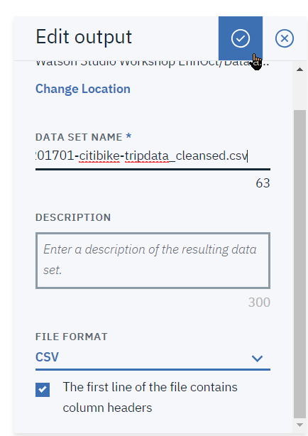.
   > You could also select the parquet format which has the advantage of retaining type more type information tahn CSV for the columns, and can be used as input in notebooks or further data refinery operations.
1. Finally click the `Save and Run` button: 
> Notice that you could have schedule your data flow to run on a defined time of the day.  

1. Select `View flow` on the next window: 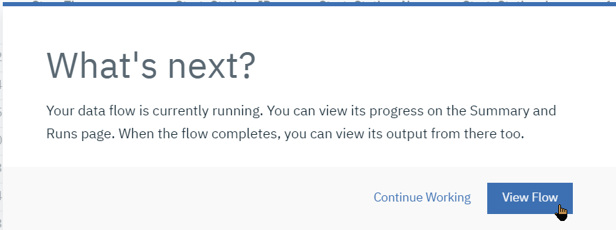
1. Wait for the flow to complete processing. The flow executes in the Spark engine and should take less than a minute to execute over the 700 thousands records.
1. Once executed, you can go back to the project assets, and you will find the generated `201701-citibike-tripdata_cleansed.csv` file that you can browse by clicking on it. We will reuse this file in the following part of the Labs.
1. The same processing pipeline could be applied to another file than the one used to create the Data Flow, using the `Change Data Asset` button 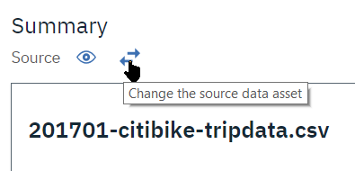

## [B.7]. OPTIONAL: Data Refinery Stretch Lab
The instructions below guide you through more advanced functionality of Data Refinery.
These steps are optional, you may execute them if you feel comfortable enough with the toolset.   
We will show how to reduce the volums of data through aggregation functions.

### Optional 1: Aggregation by day and station
From the output of the Data Refinery flow created above, we will prepare another flow which aggregates bike departures per day and starting station.   
This aggregated data asset is less voluminous than the original one and could be used for efficient reporting and dashboarding.   
This how the use of `group_by` functionality.

1. Go back to your project's Assets list, select your `201701-citibike-tripdata_cleansed.csv` Data Asset, and select `Refine` from its `Actions` menu: 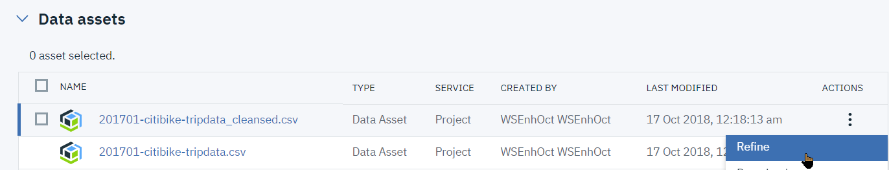
1. Change the name of the flow to `201701-citibike-tripdata.byday`: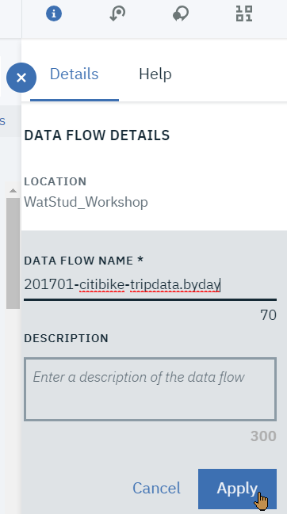
1. Add operations to Remove the 6 columns `Start/End Station Name/Latitude/Longitude`, as well as column `User_Type`, `Bike_ID` and `Birth_Year`. Also Remove `Start/Stop_Time` and `Start/Stop_Hour`.
  At the end, here should be only 7 columns remaining: `Trip_Duration`, `Start/End_Station_ID`, `Gender`,`Age`, `Start/Stop_Date`, with 13 recorded steps: 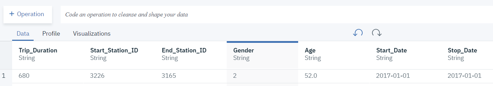
1. We need to convert the `Age` and `Trip_Duration` to `Integer` format so that we can compute their average, add two `Convert column type` operations: 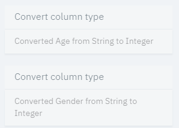
1. Select the `Trip_Duration` command, then the `Aggregate` operation, then check `Group by columns`, and select columns `Start_Date` and `Start_Station_ID`: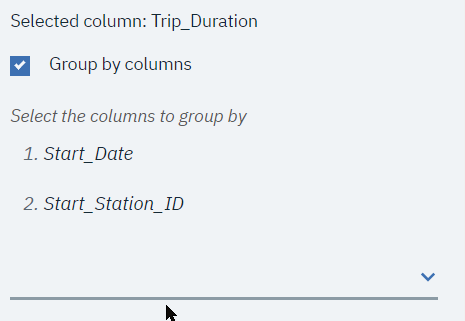
1. Select `Aggregation 1` as `Count unique values` and name it `Trip_Count`: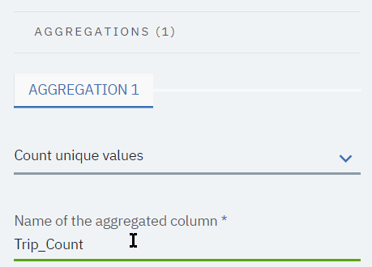
1. Add a second aggregation, of type `Mean` and name it `Trip_Mean` 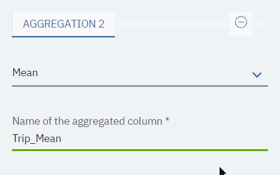
1. Apply, and you will get 4 columns as result: 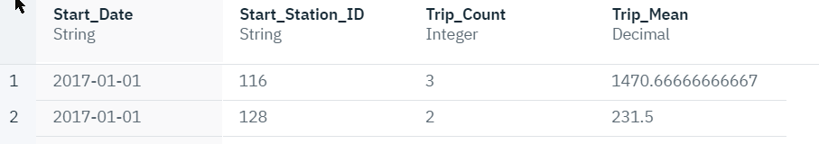
1. Save this new flow and run it. Change the output Data Set Name to `201701-citibike-tripdata_byday.csv` in CSV format: 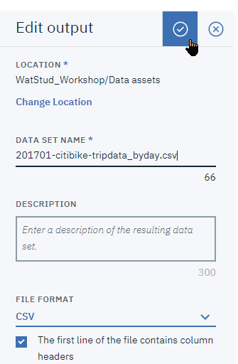
1. After running, the flow should yield a new Data Asset with much less rows, 18399 vs the original 697600: 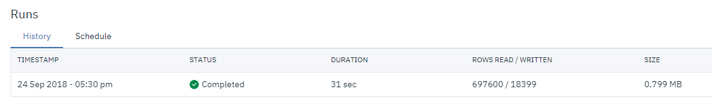

### Optional 2: Extract Station Name, Latitude, Longitude by ID
In this section, we will create a Data Flow which just extracts the stations data from the main dataset, which holds redundant information, Keeping for each StationID its name and Latitude, Longitude.

1. Create a new Data Flow (from Tools/Data Refinery), select the project and then the original `201701-citibike-tripdata.csv` Data Asset.
1. Remove all the columns except those that start with `Start Station`: Add a `select` operation `select(starts_with("Start Station"))`: 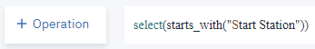
1. Coallesce all the rows by removing duplicate Station ID: 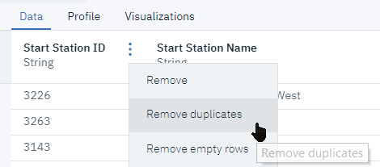
1. Change the column names to `Station_ID`, `Name`, `Latitude`, `Longitude`: 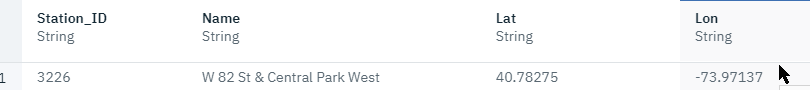
1. Change the flow name to `citibike-extract-stations`: 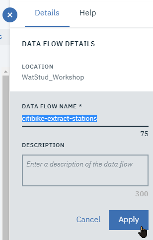
1. Save and execute the flow, change the output file name to `citibike-stations.csv`: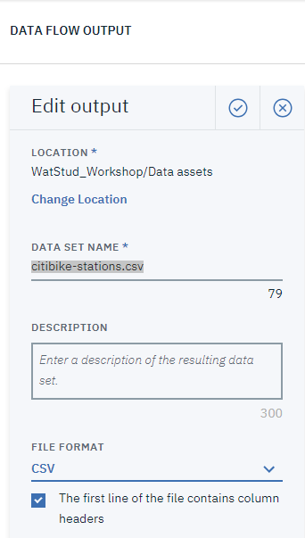
1. After `[Save and Run]`, then `[View flow]`, you should get an output file with 609 rows: 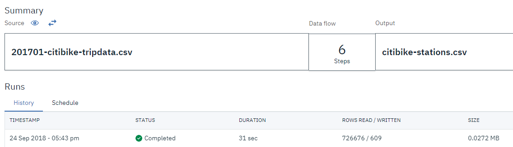

## Conclusion of Data Refinery section
We have experienced the Data Refinery which is Watson Studio's integrated ETL (Extract, Transform and Load) tool. You have seen that the tool is designed to define ETL operations without coding, even though it can be complemented by formulas.

In a Data Science pipeline, ETL tools are almost always required as first steps in the data processing. It allows to perform Data Cleansing and Feature Engineering.

### A word on file type conversion
Data Refinery also allows to generate data Asset output in 'Parquet' or `Avro` file formats, which are file formats specified as part of the Apache Hadoop project, optimized for respectively column and row-oriented  data storage and retrieval in a Hadoop or more generally Data Science environment.   
Parquet is not as efficient as zipping a file, but can readily be used by data processing tools, and it carries meta data information such as column types.   
In the case of this input file, the resulting parquet conversion would yield a file of about 42 MB, vs 116 MB for the raw CSV file and 23 MB for the zipped CSV.

---
# [C]. Using notebooks for data exploration
In this section, we will start exploring the data from a file which holds customer sales observations related to buying behavior of customers of an outdoor equipment company regarding tent purchases, using a Jupyter notebook.

This is a different approach to data analysis than the GUI-driven tools such as Data Refinery, here the paradigm is to perform programmatic operations on data files rather than GUI driven.   
Each approach has its pros and cons, and selecting one versus the other can be a matter of personal preference.

## [C.1]. Explore the data set
Ensure that the `GoSales_Tx.csv` file is part of the data assets, so that we can start to have a look at the data:
1. open the corresponding asset by clicking on the file name from the list
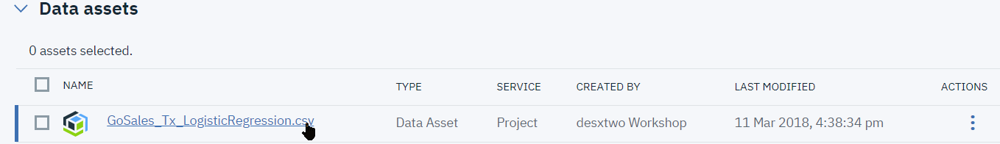
 This opens into the tabular preview, where we can discover the data structure:   
| `IS_TENT` | `GENDER` | `AGE` | `MARITAL_STATUS` | `PROFESSION` |
| Type: String | Type: String | Type: String | Type: String | Type: String |   
So there are basically 4 features that can drive the buying decision held in the `IS_TENT` column.
1. To go further in the analysis, we will create the Profile for the data:
   * Select the `Profile` tab and then the `Create Profile` button.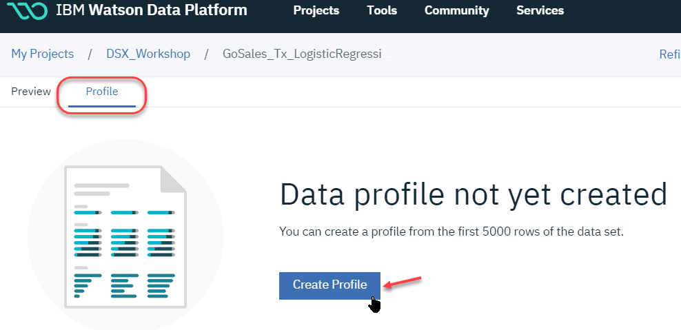
   * After a while, the data profile is computed on the first 5000 lines.
   * This gives a rough idea on the structure of the data through the content of the columns in statistical terms:
     * `IS_TENT` is detected as a boolean with roughly 10% occurences of `TRUE` (509 out of the 5000 sample)
     * `GENDER` has slightly more Male than Female.
     * `AGE` distribution shows a peak in the 24-30 years, with an average of 34:
     * `MARITAL_STATUS` has half of the sample as married
     * `PROFESSION` shows almost half of the sample unspecified, with 8 distinct professions.
1. This gives a first-level overview of what to expect. We will now use the `GoSales_Tx_Analysis.ipynb` notebook for more data analysis:
   1. Go back to the Project page
   1. From the (+) Add to project menu, select `Notebook` :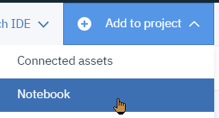
   1. Select the `From file` tab, scroll down to `Choose file` and select the `GoSales_Tx_Analysis.ipynb` file 
   1. For this first lab, we'll use a plain Python Jupyter notebook:
      In the bottom-right section below, select the `Default Python 3.5 Free` runtime environment: 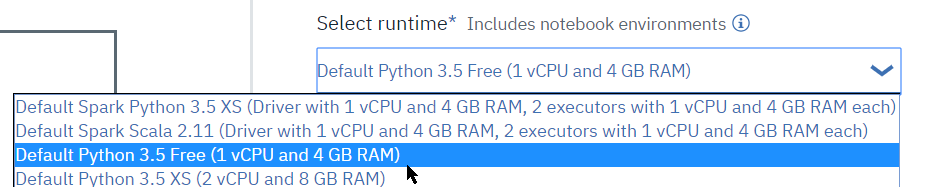
      (We will use a Spark environment in a later lab).
   1. **Open** the notebook. From that point on, follow the instructions that are within the Notebook.