# Build, train, and deploy a machine-learning model without coding and invoke it from the Command Line

Get experience with **IBM Watson Studio** by creating a decision-tree machine-learning model to evaluate the risk that a customer might leave your service.

**Duration:** 20 minutes

**Experience:** clicker

In this tutorial, you use **IBM Watson Studio** to train and deploy a machine-learning model without any coding or manual model building skills. For this task, you will use the **Model Builder** capability of **IBM Watson Studio**.

You complete the following tasks:
  * Create a project (unless you have already an existing project)
  * Load a data set into the project (unless needed data is already part of your project)
  * Use the IBM Watson Studio Model Builder to train, test, and evaluate a machine-learning model
  * Deploy the model
  * Invoke the model from a CLI  

## Log in to IBM Watson Studio
In **IBM Watson Studio**, data scientists work and collaborate in projects. In this task, you set up a project.

> If you have already completed previous labs on IBM Watson Studio, jump directly to the Data Assets section on bullet 8.

1. Go to **<https://dataplatform.cloud.ibm.com>** to access IBM Watson studio cloud-based service.  

2. Click **Login** and provide your IBM ID credentials.  

3. When logged in to IBM Watson Studio the first page that you see is the **Get started with key tasks** which helps you to get a customizable user experience whether you are a data scientist, a data engineer... You can minimize this pane clicking **Hide**.
If you scroll, you can explore the **Community Page** where you can distribute public assets, such as notebooks and data sets, which can be used by any IBM Watson Studio user. Community page is also a great way to grow your data scientist skills.  

4. In the upper-right corner, click the **+ New Project** link, to create project. Alternatively you can use an existing project.
The "New project" page opens and lists a set of templates (tiles) which tailor the tools based on the tasks you want to accomplish.
Select **Modeler**.  

5. Give your project a name, let's say `CustomerChurn`, a detailed description.  

6. Click **Create**.
On the project's summary page, you can see that the project has no assets.  

7. Click **Assets**.
The various project components are shown, such as notebooks, models, and data sets. You're going to add a data set to the project.  

> **Note:** if you have completed the **Data Refinery** lab, your data should already be part of your project. We will work with the `customer_churn` dataset. You can **jump to the next section Create a Model**.

8. **Data sets** can be local or remote. In this tutorial, you work with a small local data set.  

**Click the Find and add Data** icon which looks like a 10 01 button. It will open the file management sidebar.  

9. From the **Load** tab, Click **Browse** to select from your local file system.
Navigate to the lab files folder (given by your instructor) and select `customer_churn.csv`  and click **Open**.
Alternatively, you can drag and drop a file directly into the sidebar.
The file is added to your local data sets in your project.

Next, you will create a machine-learning model by using this newly loaded data set.

## Create the model
Create a model by using the IBM Watson Studio model builder.

1. Scroll to the **Models** section of the project.

A project can host several models of different types:
  + Natural Language Classifier models
  + Visual Recognition models
  + Watson Machine Learning models  

2. Click **+ New Watson Machine Learning Model**
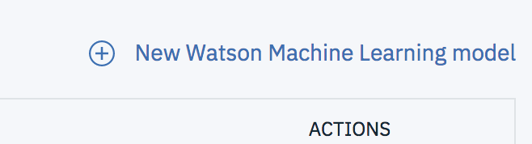  

On the New Model page, the `Model builder` model type is selected by default.
3. Give a name to the model, `customerchurn` for example.
The model builder can be fully automated or can leave certain steps to be completed manually. In this tutorial, you use the manual option so that you can review the capabilities of the model builder.
> Notice that an **IBM Watson Machine Learning Service** is required.    

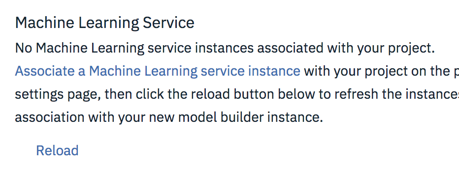

4. You should select an existing one or you can create a new one at this point clicking on the `Associate a Machine Learning service instance` link. A new browser tab will open, select the `Lite` plan for your Watson Machine Learning service.
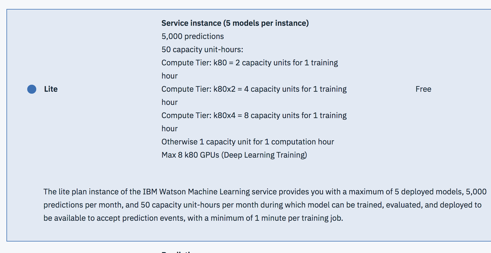

5. Accept the default name and click `Create`.  
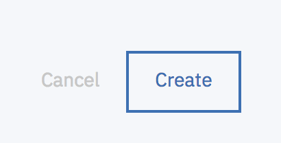

6. Navigate back to your project. The newly created **Watson Machine Learning Service** should be selected, if not or not shown on the list `click` the Reload button.
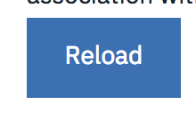

A **Spark Service or Environment** is also needed at this point. Select your service or create a new one at this point.  

7. Select `Model Builder` as the model type.
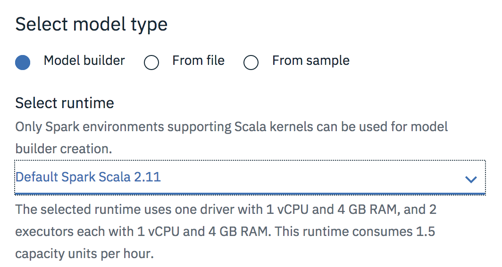

8. Click **Manual** to get more options in data selection for training your model.  
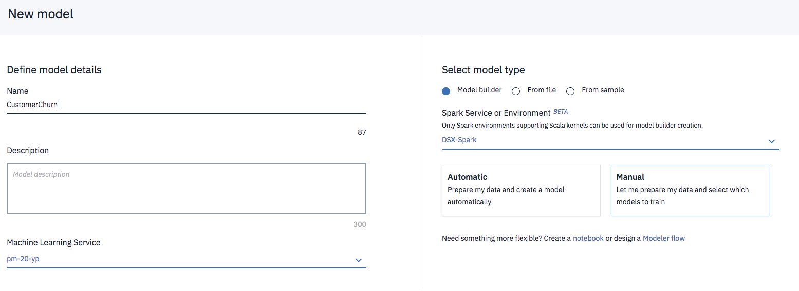  

9. Click **Create**.  

10. On the "Select data asset" page, you can select the data asset to use to create your model.
Click `customer_churn.csv` and then click **Next**.
> Note that you could also add your Data Assets from here.   

  

11. On the "Select a technique" page, you select the attributes of the machine-learning model.
From the **Column value to predict (Label Col)** list, select **CHURN**. This is the column that contains the historical outcomes and thus the predicted outcome.  
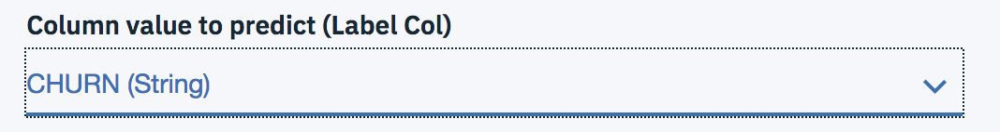  

12. The **Feature columns** are columns that contain the attributes on which the machine learning model will base predictions. All columns (features) are selected by default, you can leave it as-is or select **all BUT the ID column**.
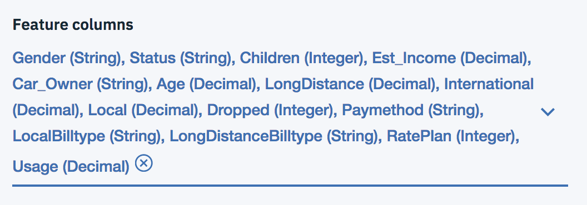

7. The model builder selects **Binary Classification** by default as the type of model to build. Because you want to create that type of model, leave the selection as-is.
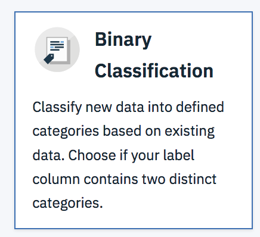

8. In the upper-right corner, click **Add Estimators** to select the type of machine-learning algorithm to train.

9. On the "Select estimator(s)" window, from among the four algorithms, click **Random Forest Classifier** and **Gradient Boosted Tree Classifier**. Click **Add**.
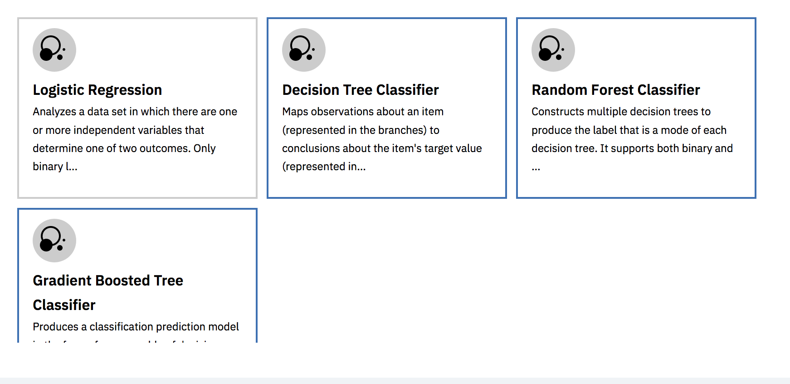
> The estimators (machine-learning models) are shown on the next page, where you can also modify the percentage split between training, testing, and validation sets. Leave the default settings as-is.   

10. Click **Next**.
The models are trained and their respective evaluations are displayed. The Gradient Boosted Tree Classifier model shows better performance results and is selected by default.  
   
 

11. Select the `RandomForestClassifier` (or the one with the highest score) and Click **Save**. When you're prompted to confirm, click **Save** again.
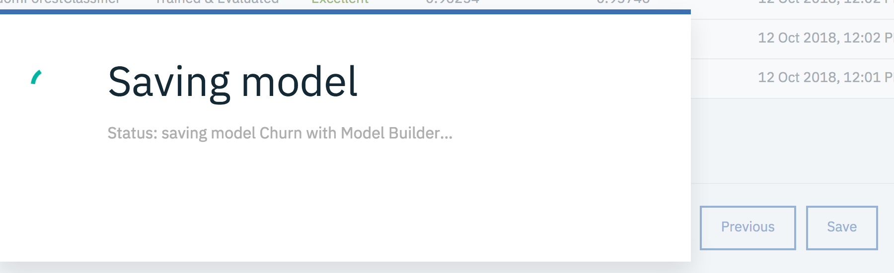

> NOTE: The ROC (Receiver Operating Characteristic) and PR (Precision Recall) Area Under Curve (AUC) are metrics used to evaluate the accuracy of a model's true positive and true negative predictions, evaluated on the test subset.

You're now back to the **Models** summary page, on the **Overview** tab, where your new model is listed.
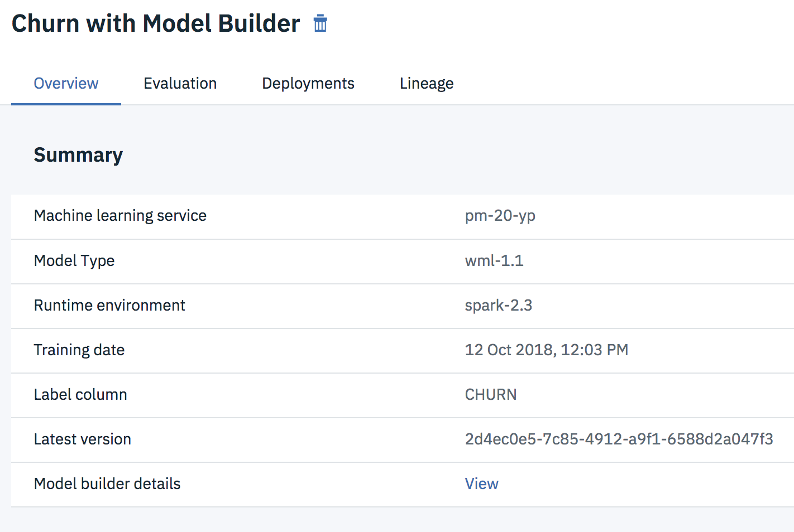

You now have a trained model, next you will deploy the model to test on out-of-sample data.

## Deploy and test a trained model
Before you can use your trained model to make predictions on new data, you must deploy the model. It's time to deploy the model and start to score a few records.

1. From the model summary page, click the **Deployments** tab.  

2. Click **Add Deployment** link on the upper-right section of the pane.  

3. On the **Create Deployment** page, give a name and a description to your deployment, say `CustomerChurnDeploy`.
> Note that deployment must have a unique name.    

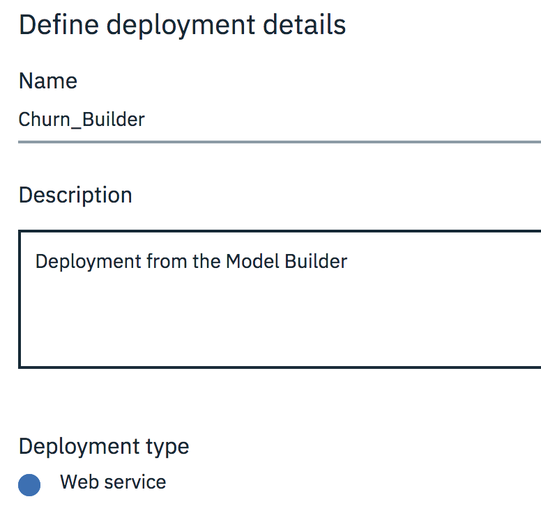

4. By default **Web service** is selected as the deployment type. Click **Save**.
> **Batch prediction** and **Realtime streaming prediction** are deployment types for continuous learning and model evaluation. For **Batch Prediction** source could be a file in your **IBM CLoud Object Storage** or a connection and table from **IBM DB2 Warehouse on Cloud**.
For **Real-time Streaming** the source is a streaming data source from a **Message Hub** instance.   

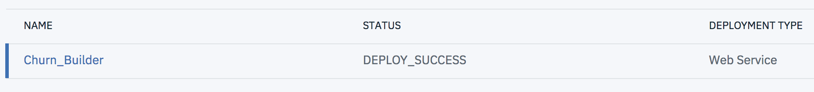

5. When model deployment is complete, from the **Actions menu**, click **View**. Alternatively you can click on the Deployment name. The **Deployment Details** window appears.  
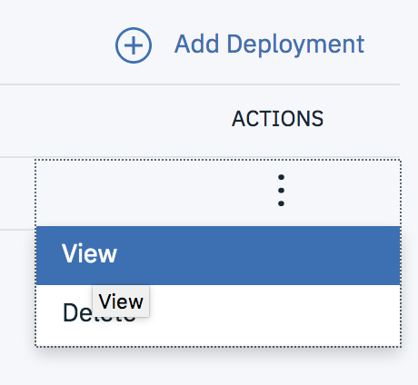  

6. Click on the **Implementation** tab. Note the scoring end point for future reference. **You can only have one deployment per user**.  
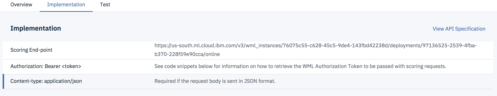  

> The **Code Snippets** are available to pass it on to you application developer to integrate the deployed model into a business application.   

7. Now is a good time to test the model prediction. Go to **Test** tab.  

8. Enter data in all the fields for a sample record from the data set.   
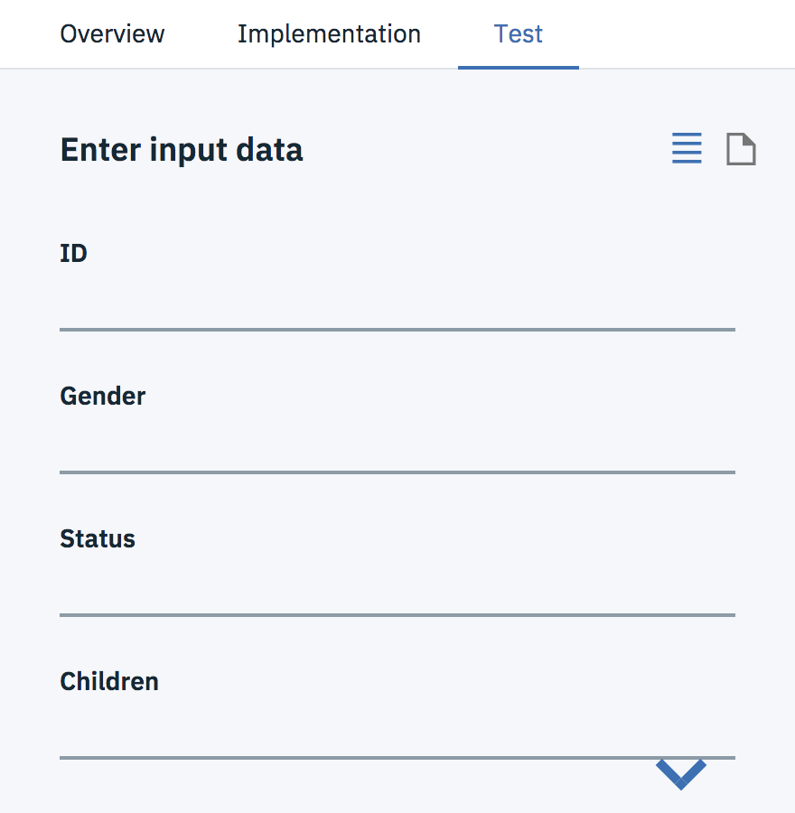   

Get data from the `payload.json` file or copy the data from here and paste into the `Input JSON Payload data`:  
`{"fields":["ID","Gender","Status","Children","Est Income","Car Owner","Age","LongDistance","International","Local","Dropped","Paymethod","LocalBilltype","LongDistanceBilltype","Usage","RatePlan"],"values":[[3484,"F","M",2.000000,41876.600000,"Y",44.093333,6.780000,0.000000,132.650000,0.000000,"CC","FreeLocal","Standard",139.440000,4.000000]]} `  

9. To test the model click **Predict**.  
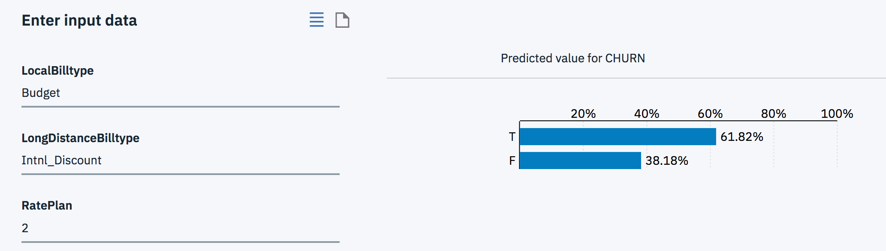  

10. You can test several out-of-sample records provided as a payload in JSON format. Click on the **document** icon and use the payload from the `payload2.json` file.  

The results of scoring the tuple (tuples) against the model are shown either in raw data format or as an output chart.

## Score from the command line
**IBM Watson Studio** has a built-in test client but you could opt to use `cURL` call from any command-line interface or in a web front-end application. In order to do so, you will have to retrieve an **Authorization token** to access your **IBM Cloud Watson Machine Learning Service** instance.

1. Navigate back to the **Implementation** tab of the deployed model summary page.  
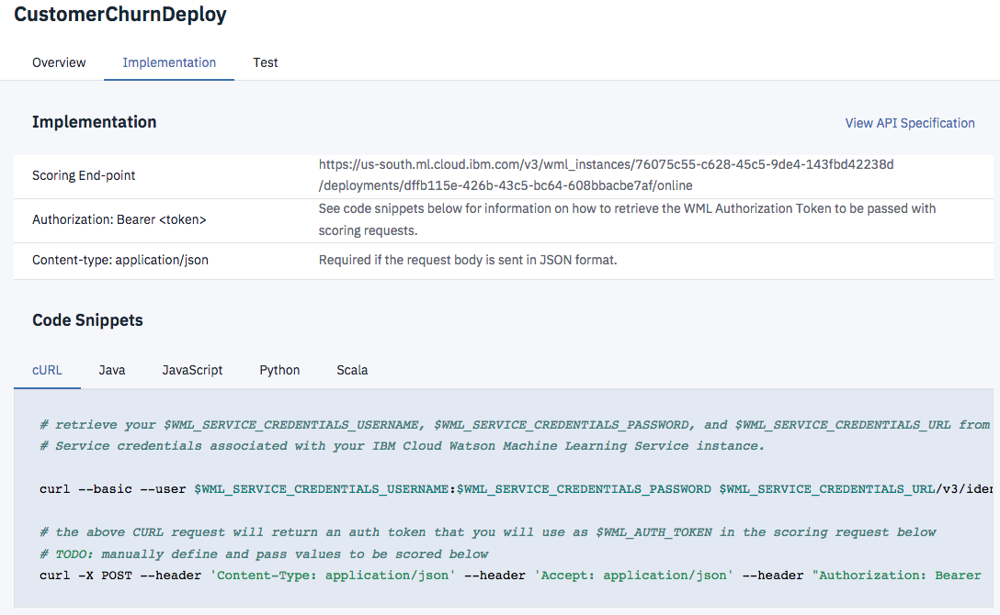

2. In the **Code Snippets** for the `cURL` tab, you'll see two *curl* commands. The first one retrieves the token.  
The second one sends the scoring request to the deployed model.  
Copy paste those lines of code to prevent from typing again.
> Note that service credentials are needed for the IBM Watson Machine Learning Service instance.  

3. Navigate back to the **Overview** tab. Notice the **Machine learning service** line, this is the service your deployed model is running on and you need to retrieve the service credentials for this one.  

`curl --basic --user $WML_SERVICE_CREDENTIALS_USERNAME:$WML_SERVICE_CREDENTIALS_PASSWORD $WML_SERVICE_CREDENTIALS_URL/v3/identity/token
`   

4. From the toolbar, click on **Services** tab and **Watson Services** to open in a new window. Hit the `Cmd` key on Mac to open in a new browser tab.

5. The **Watson Services** page is displayed with several sections (Discovery, Personality Insights, Machine Learning, ...). Scroll to **Machine Learning**, you should see your service instance. Click on the service name to display the service management page.  
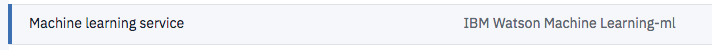

6. From the left sidebar, click **Service Credentials**. If there are no credentials listed, click on **New credential**, provide a name and click **Add**.  

7. From **Service Credentials** list, click on **View credentials** in the **ACTIONS** column.  
  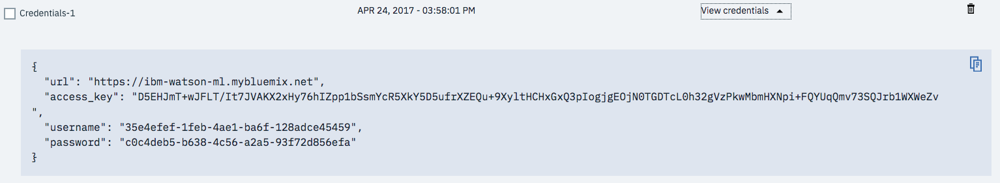
  Copy the credentials using the copy icon on the upper-right corner of the code pane.  

8. Open a `terminal` or a `command line` window.

9. Set the variables based on the provided credential values.  
  `export WML_SERVICE_CREDENTIALS_USERNAME=<your value>`  
  `export WML_SERVICE_CREDENTIALS_PASSWORD=<your value>`
  `export WML_SERVICE_CREDENTIALS_URL=https://ibm-watson-ml.mybluemix.net`  
  > **NOTE:** Depending on your operating system the variables are set and accessed differently. The above code works on Linux based systems.
  If you are running on **Windows** operating system, use the `set` command to set a variable.
  Use `%my_variable%` to access it as in the example below:
  `set WML_SERVICE_CREDENTIALS_USERNAME=<your value>`
  `curl --basic --user %WML_SERVICE_CREDENTIALS_USERNAME%...`

10. Retrieve your access token running the command below.  
  `curl --basic --user $WML_SERVICE_CREDENTIALS_USERNAME:$WML_SERVICE_CREDENTIALS_PASSWORD $WML_SERVICE_CREDENTIALS_URL/v3/identity/token`  

11. Set the token in your environment for later use.  
  `export WML_AUTH_TOKEN=<token value>`  

12. Run the following `cURL` command providing the array of test values available from the labs data folder.

  `curl -X POST --header 'Content-Type: application/json' --header 'Accept: application/json' --header "Authorization: Bearer  $WML_AUTH_TOKEN" -d '{"fields": ["ID", "Gender", "Status", "Children", "Est Income", "Car Owner", "Age", "LongDistance", "International", "Local", "Dropped", "Paymethod", "LocalBilltype", "LongDistanceBilltype", "Usage", "RatePlan"],"values": [$ARRAY_OF_VALUES_TO_BE_SCORED, $ANOTHER_ARRAY_OF_VALUES_TO_BE_SCORED]}' <scoring end-point>`  

  >Note your **scoring end-point** should look something like the following URL (it might be a good idea to set it as an environment variable as well):    https://ibm-watson-ml.mybluemix.net/v3/wml_instances/3ce58d3c-f96f-455f-bfd0-c3b81e44fef5/deployments/df11c348-c319-4b20-bf90-97fd7c4d417b/online  

  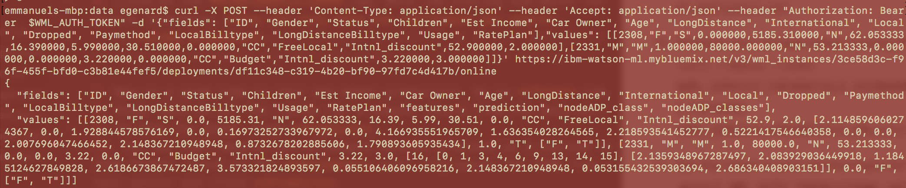

You completed the lab for Training and Deploying a model using the **IBM Watson Studio** model builder.
