# Create a Model using Flow Modeler

## Overview
In this lab you will learn how to implement analytics in the Flows interface of the **IBM Watson Studio**. You will continue to work on the same use case with the dataset that you have already **refined**.  

## Create a Modeler Flow

1. Navigate to your project.  

1. On the `Assets` tab scroll down to **Modeler Flows** and click on `New Flow`.
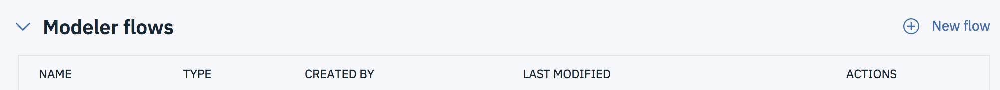
2. Name the flow `TelcoChurn` or any name of your choice and make sure **IBM SPSS Modeler** runtime is selected. Click **Create Flow**.
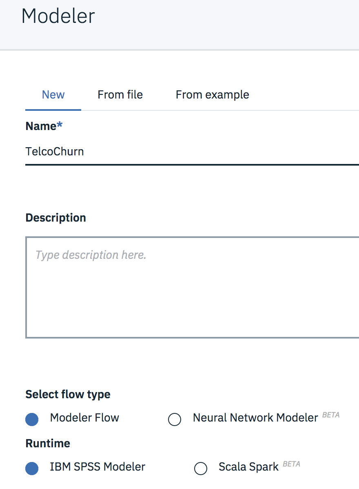   

> The Flow Editor will open. It is a **flow-based programming** tool providing a **clickers** user experience. The main pane is your workspace on which you **drag and drop** nodes from the palette.
> 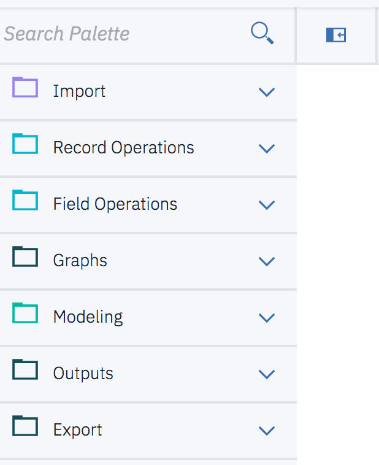  

>The **palette** contains multiple nodes grouped in categories:
> - Import: to connect to your data, this is a beginner node in your flow.
> - Record Operations: to transform your data from a record standpoint (ex: filter, sort, sample, merge...)
> - Field Operations: to perform column-level operations (ex: filter, derive, transpose, restructure, type, set to flag...)
> - Graphs: let's you do data visualization with various forms of charts
> - Modeling: contains a multitude of modeling techniques for classification (binary classification, regression, random forest...), clustering (K-means, XGBoost Trees, ...), anomaly detection and many others
> - Outputs: used to format your results, this is an ending node in your flow.
> - Export: exports data to your project Data Assets, this is an ending node in your flow.
> You will build a **Flow** connecting or **wiring** the nodes to one another in sequence as many steps of your predictive model.  

3. **Drag and drop** a `Data Asset` node from the Import section of the palette onto the workspace.   

3. **Double-click** on the node to open its properties sidebar on the right.

3. **Click** `Change data asset` and select `customer_churn.csv` file.
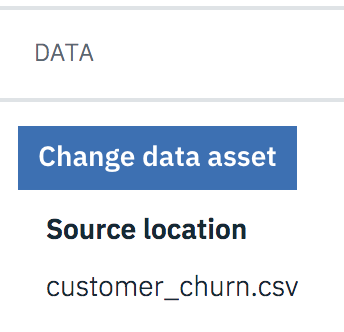

4. **Click** on the three dots of  the data asset in the canvas and select `Preview` to view the data.
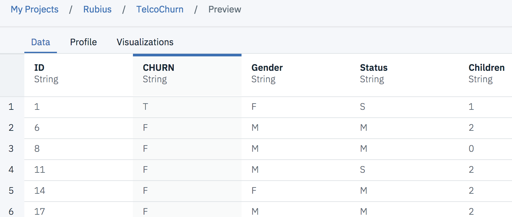  

5. **Click** on the  `Flow name` in the breadcrumb navigation above the toolbar.

10. Next, you can connect the data asset to different types of graphs to get a better understanding of data. For example, you can add a `Distribution graph` and display `churn` by `gender`.
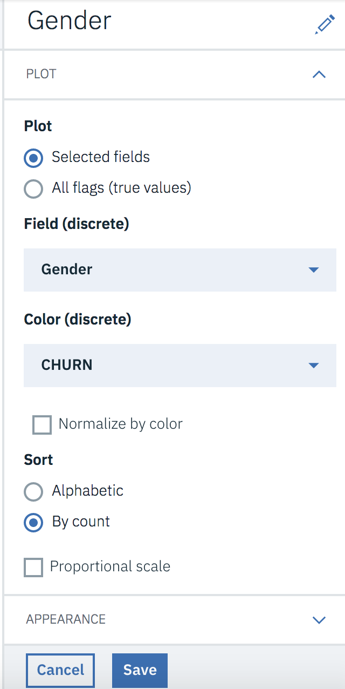

  - **Double click** on the `Distribution` node to edit it. Then right click and select Run.
  - **Distribution by Gender** is shown in the Ouputs panel. Double click to display it.
  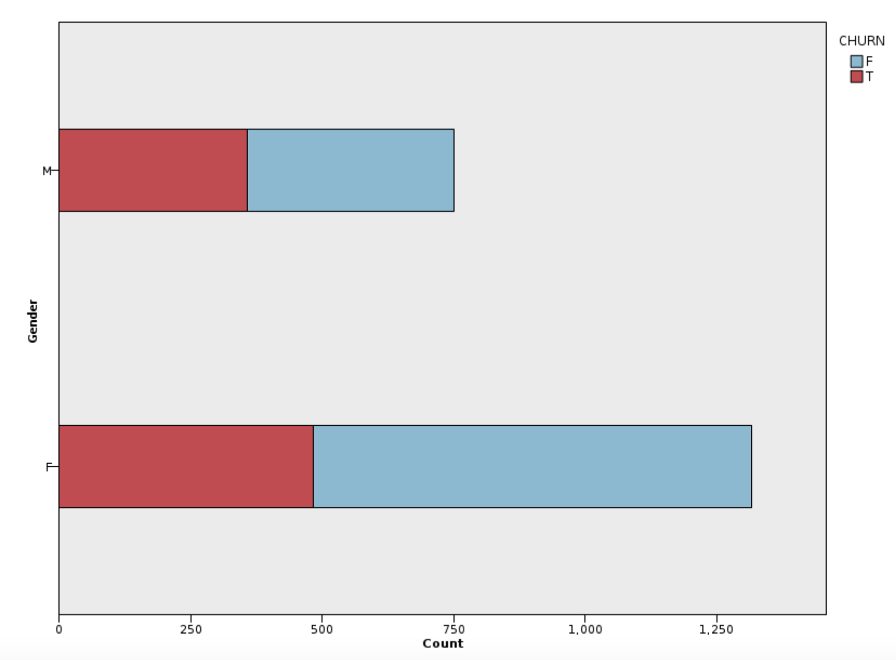

11. Next, we are going to build a model for predicting **churn**. Add a `Type` node from the Field operations and connect it to the `Data Asset` node.
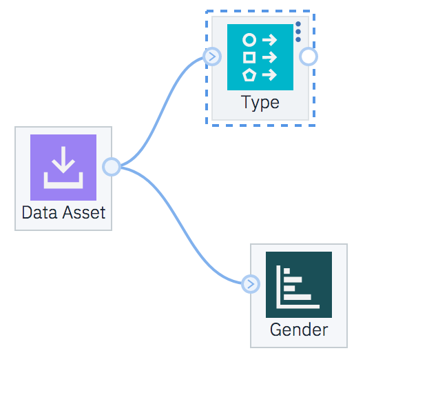

12. **Double click** on the  `Type node` and click `Read Values`. On this screen we are selecting the fields that will be used for modeling.

13. Select all fields with the exception of ID (because ID is not a predictor for customer churn). Return back to the main screen and change `Role` of **CHURN** field to `Target` and `Measure` to `Flag` because that’s the value we would like to predict.
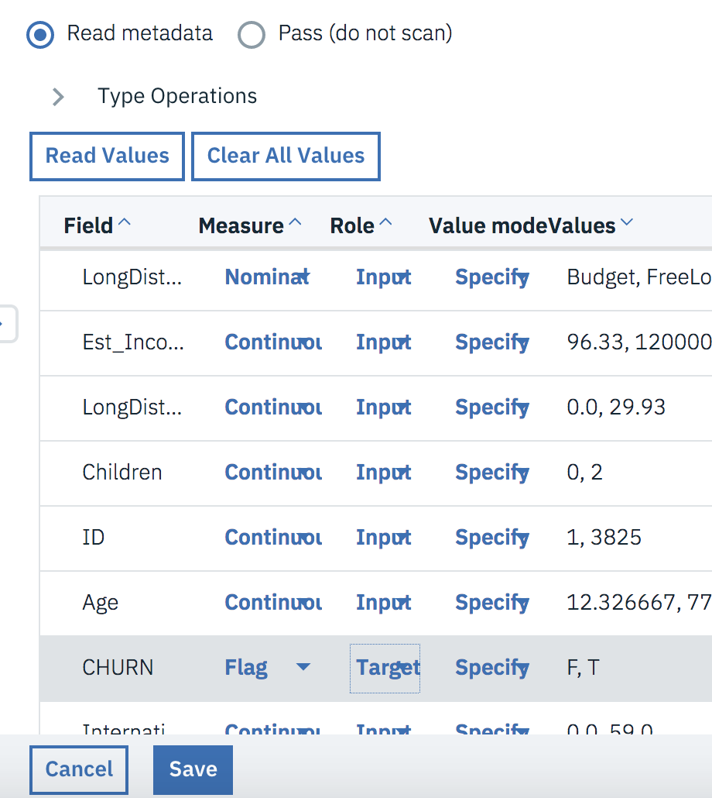

13. Click **Save**.

> Notice the number of modeling techniques available from the palette. It's hard to know each and every technique, for this lab we'll use the **auto-classifier** which is a special node that will select the most appropriate classification models for us.  

14. From the `Modeling` section, **Add** the **Auto-classifier** node. **Wire** the `Type`node to the newly added node.
> Notice that automatically the modeling node is renamed **CHURN**, in fact it is set to the name of the `Target`.  

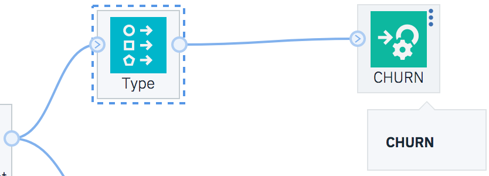

15. **Right click** on the `Auto-classifier` node on the canvas (CHURN) and select **Run**.

16. Model building will take a few minutes. When model building is done, you’ll see an orange `Model nugget` on the canvas.

17. Right click on the `Model nugget` and select **View Model**.
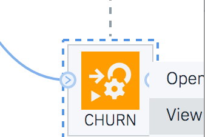
Explore the model. For example, **click** on `Random Trees` and navigate to `Confusion Matrix` and to `Top Decision Rules` tab shows the combination of predictors that result in specific customer churn value.
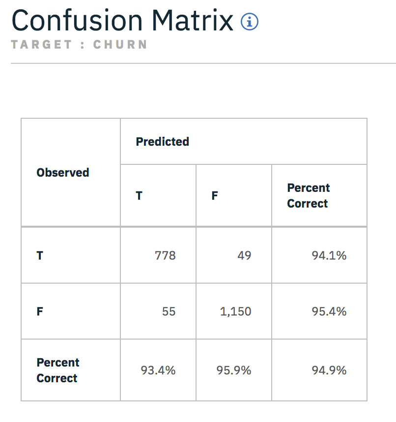  

18. Navigate back to the `Flow Modeler`. Finally, **add** a `Table` (from Outputs tab) and an `Data Asset Export` (from Export tab) nodes and connect them to the model nugget.
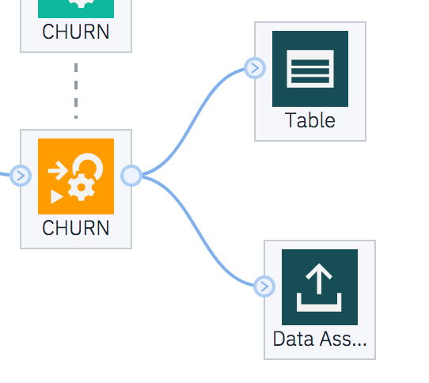

19. **Double-click** on the `Data Asset Export` and provide file name, for example, `ScoringOutput.csv` and the append to the end option if data already exists.

20. You can run the entire stream by clicking the **Run** icon (arrow). When the stream runs, it scores the data and writes it to the specified file in the Object Store as well as the visual output (Table).
  - Table output can be viewed by **clicking** on the Table in the `Outputs` view.
  - Scroll all the way to the right and you’ll see two values generated by the model – the predicted value **$XF-CHURN**  and the confidence in the prediction **$XFC-CHURN**
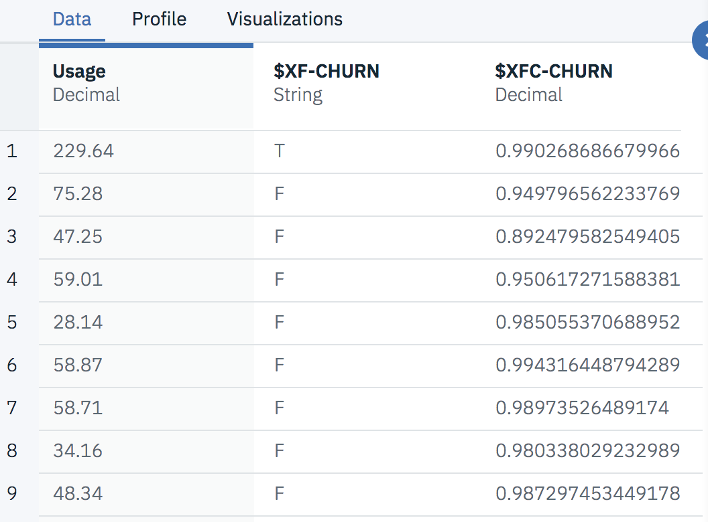

21. So far we’ve built and scored the model using the training data. Models are typically evaluated with a different data set. If you wish, you can import the `new_customer_churn_data.csv` data set that’s located in the data folder of the unzipped file from GitHub.
  - After adding `new_customer_churn_data.csv` to the Data Assets on the Project page, connect it directly to the model nugget. You will first need to delete a connection from the Type node.
   - You can also add the `Analysis` node from the Output tab and connect it to the model nugget.
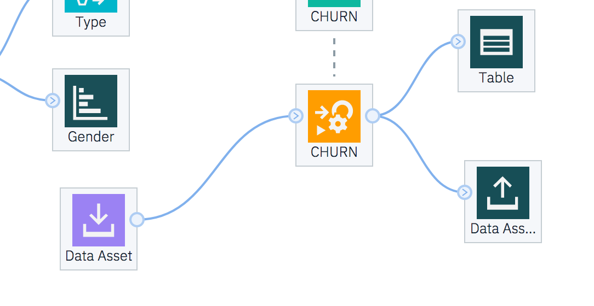

22. **Right click** on the `Analysis` node, select the `settings` you want and select `Run`. The results are shown on the Outputs tab.

You have finished developing a model to predict customer churn. This model can be deployed in Watson Machine Learning for batch or real time scoring. Once deployed, the model can be integrated with Line of Business applications.

## Deploy the model on IBM Watson Machine Learning

1. **Right-click** on the `Table` output node and select `Save Branch as Model`.
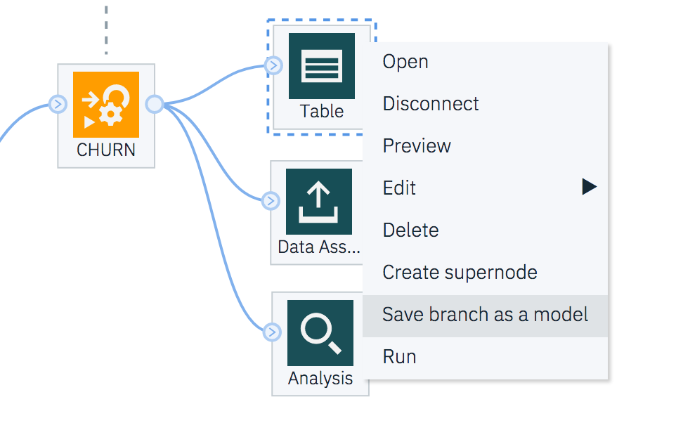

2. Give a name to the saved model and **Click** `Save` and then `Close`.
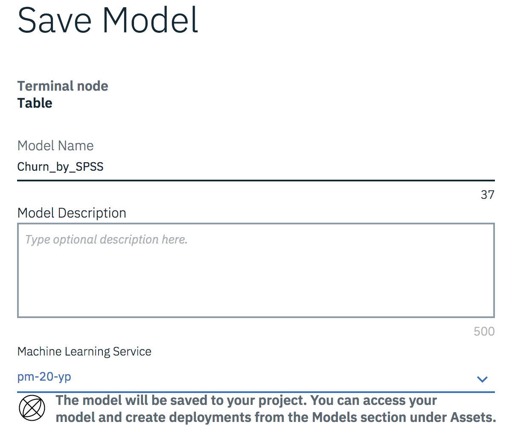
> **Note** the IBM Watson Machine Learning Service on which the model will be attached to. This is service associated to your project. Now you need to deploy the model.

3. Navigate to your project `Assets` tab. You should see the saved model in the Models section.
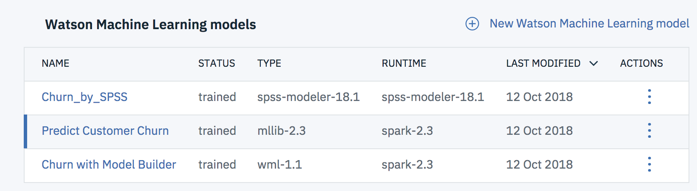

4. As you already did in the previous lab, deploy the model on the **Watson Machine Learning Service**. Once deployment is successful, you're to **Test** the model as you did with other models (let's see if you remember from the previous section).

You have successfully deployed another model, using yet another tool and another user experience through the **Flow Modeler**.  
When you will do the integration part of the Lab, you will be free to use whichever endpoint - thus whichever model to bind to your application.

**Congratulations**
