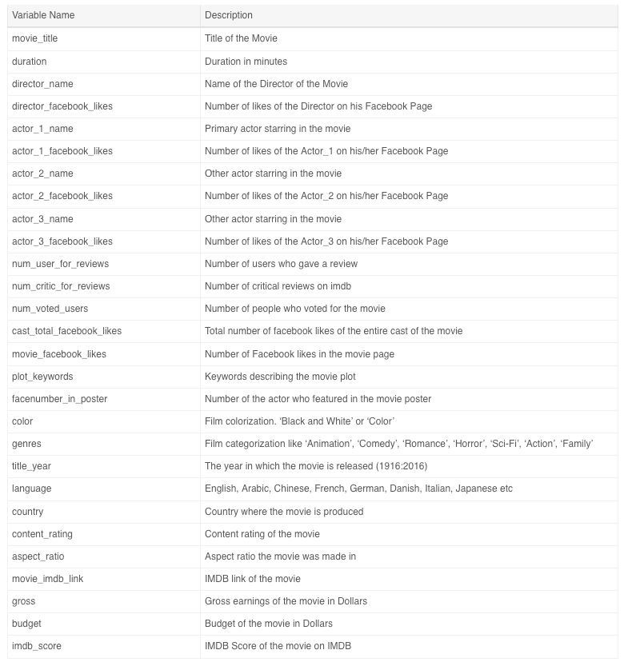

# ISEN Data Science Workshop Evaluations

This page describes the assessment work expected. **READ it carefully** to understand the expectations.

## Mission
Your mission in this project is to define an interesting business question(s) and provide informed recommendations based on data analytics. You may explore the data in ways to identify trends, clusters, interesting outliers, interesting descriptive statistics, patterns and associations. You should draw conclusions on the best decision actions to perform and insight you have discovered while highlighting the informed decisions that you recommend using analytics. As such, please do the following:
1.	Form a team (groups of 3 people, no individual work is accepted)
2.	Have a look at the data and perform EDA (Exploratory and Data Analysis)
3.	Identify the business challenge or the business question(s) can be answered?
4.	Performing analysis on data, prediction models.
5.	Write a report

## Evaluation
Your group will be evaluated based on your capabilities of:
+ Stating and understanding the business problem(s), the data provided to you and the insights you can find out of this dataset (What?)
+ Explore the actual characteristics and emerging patterns in you dataset which could help validate or invalidate problem statements issued in previous step.  (Why?)
+ Applying the methods used in class in his report.
+	Getting valuable insights for the recommended actions and answers to the business problems.

You should draw conclusions on the best actions to perform while highlighting the informed decisions that you recommend using analytics. As data scientist consultants, you are in charge of assembling your findings in a shareable report-style document that anyone new to the use case should understand.

**Output format:** Please prepare your report in a doc, pdf or Jupyter Notebook format. Your report should include figures and references you might have used.
**Tools:** you’re free to use the tools we have presented (Watson Studio, Jupyter Notebook) and other tools you might be familiar with, however make mention of it **as your work should be reproductible**
**Hints:** you’re free to leverage tutorials and videos of usage of the tools. Innovate.
**Considerations:** you will be evaluated on your **analytical approach** to solve the business problem. You are also free to refine, enrich the data the way you want if you find it useful to your study.
**Always think of reusability:** someone new to the use case with the similar data should be able to reproduce your study.
The report must be structured in the following way:
+	Title, authors, group
+	Executive Summary
+	Introduction
+	Problem Statement
+	Methodology
+	Findings
+	Discussion

Your grade will mostly rely on:
+	The approach and your group reasoning and expressing the business challenges
+	The capability of answering complex questions in simple ways
+	The quality and effectiveness of analytical research
+	The quality and effectiveness of your communication

## Due Date: March 6th, 2019

---

## Subjects

### What makes a blockbuster?
+ **Dataset:** IMDB 5000 Movie Dataset. [dataset](Datasets/movie_metadata.csv)
+ **Primary Objectives:** how are related factors associated with the goodness of movies? What makes up a good recipe for a blockbuster or a movie profitable?
+ Dataset columns explanation:
  

### Predicting house price?
+ **Dataset:** Ames, Iowa housing data set.
  + [Training data](Datasets/house_train.csv)
  + [Testing data](Datasets/house_test.csv)
  + [Feature description](Datasets/house_data_description.txt)
+ **Primary Objectives:** predict house pricing depending on house criteria.

> Hint: make use of creative feature engineering and advanced regression techniques.

### Predictive Policing
+ **Dataset:** Boston crime records from crime incident report system.  [dataset](Datasets/boston-crime-data.zip)
  + [Feature description](Datasets/boston-crime-data-description.txt)
+ **Potential Inspiration:**
  + How has crime changed over the years?
  + Is it possible to predict where or when a crime will be committed?
  + Which areas of the city have evolved over this time span?
  + In which area most crimes are committed?

### Heart Disease Probability
+ **Dataset:**  [dataset](Datasets/heart-disease-uci.zip)
+ **Inspiration:** Attempt to distinguish presence with a risk factor (values 1, 2, 3, 4) of potential heart disease from absence (value 0)
+ **Features:**
    > 1. age
    > 2. sex
    > 3. chest pain type (4 values)
    > 4. resting blood pressure
    > 5. serum cholestoral in mg/dl
    > 6. fasting blood sugar > 120 mg/dl
    > 7. resting electrocardiographic results (values 0,1,2)
    > 8. maximum heart rate achieved
    > 9. exercise induced angina
    > 10. oldpeak = ST depression induced by exercise relative to rest
    > 11. the slope of the peak exercise ST segment
    > 12. number of major vessels (0-3) colored by flourosopy
    > 13. thal: 3 = normal; 6 = fixed defect; 7 = reversable defect

### Olympics Athletes
+ **Dataset:** Contains the 11K+ athletes that participated to the 2016 Summer Olympics in Rio  [dataset](Datasets/athletes.csv)
+ **Inspiration:** can we tell which sport an athlete performs in?

> Hint: clustering, classification
