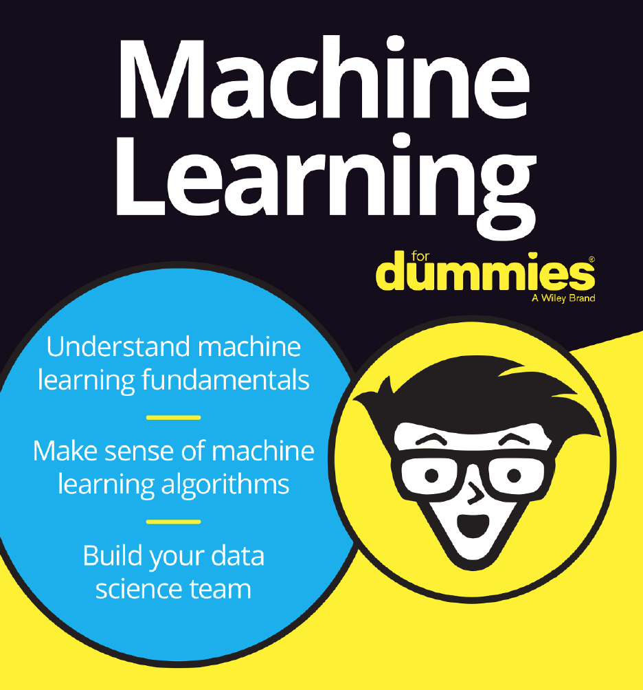
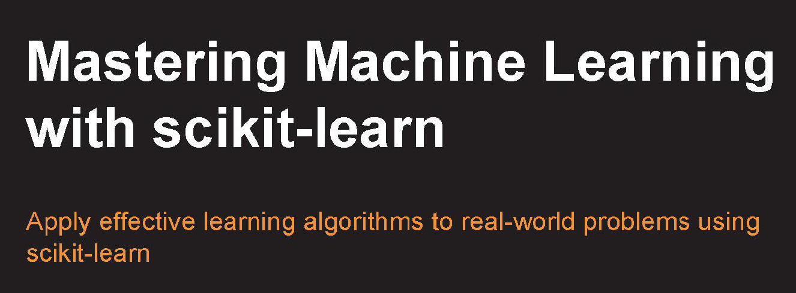
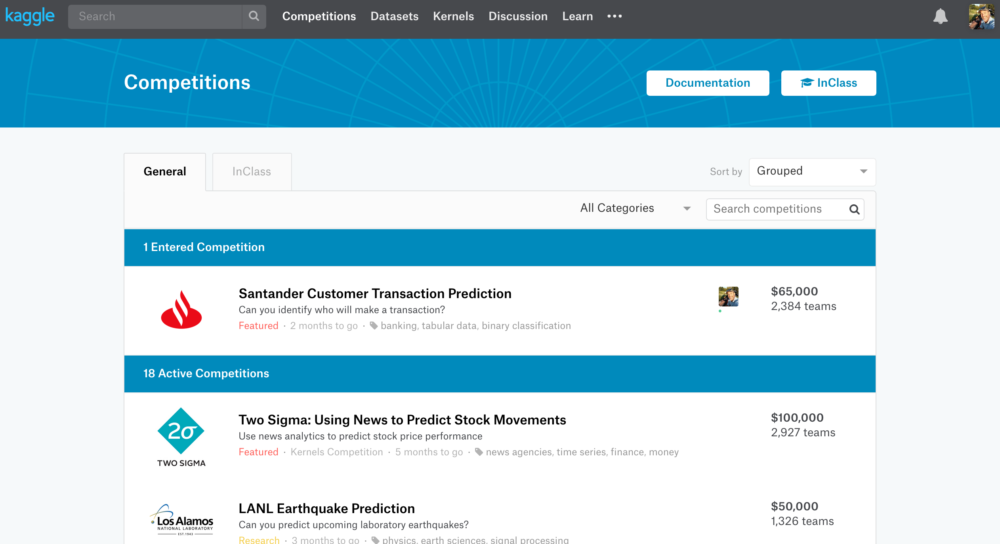
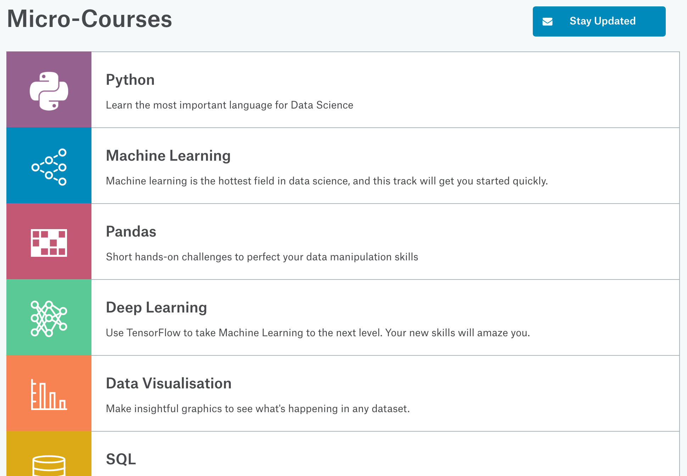

# ISEN Data Science Workshop

## Resources
In order to assist you during the Labs, make sure you leverage the following **Cheat Sheets** (source [https://www.datacamp.com/community/data-science-cheatsheets](https://www.datacamp.com/community/data-science-cheatsheets))

+ Python for beginners: [Python_CS.pdf](Resources/Python_CS.pdf)
+ Jupyter Notebook: [JupyterNotebook_CS.pdf](Resources/JupyterNotebook_CS.pdf)
+ Pandas data frame: [Pandas_CS.pdf](Resources/Pandas_CS.pdf)
+ Importing data: [ImportingData.pdf](Resources/ImportingData.pdf)
+ Numpy: [NumPy_CS.pdf](Resources/NumPy_CS.pdf)
+ SciPy: [SciPy_CS.pdf](Resources/SciPy_CS.pdf)
+ Visualization using Matplotlib: [Matplotlib_CS.pdf](Resources/Matplotlib_CS.pdf)
+ Visualization using Seaborn: [Seaborn_CS.pdf](Resources/Seaborn_CS.pdf)
+ Visualization using Bokeh: [Bokeh_CS.pdf](Resources/Bokeh_CS.pdf)

---
### Books
+ Machine Learning for dummies: 
  + Download it [here](Resources/ibm-machine-learning-for-dummies-ibm-limited-edition_IMM14209USEN.pdf)  

+ Mastering Machine Learning with scikit-learn. 
  + + Download it [here](Resources/mastering-machine-learning-with-scikit-learn.pdf)  

### Kaggle
**Kaggle** is an online community of data scientists and machine learners, owned by Google LLC. Kaggle allows users to find and publish data sets, explore and build models in a web-based data-science environment, work with other data scientists and machine learning engineers, and enter competitions to solve data science challenges.  
It is a good starting point to learn Data Science through their **Getting Started competitions** and the kernels shared by the community.
  

Now part of **Google**, Kaggle has a series of learning series: https://www.kaggle.com/learn/overview

### DataCamp
Most of the cheat sheets above come from **DataCamp**  

### CognitiveClass.ai
[CognitiveClass.ai](http://cognitiveclass.ai) is a eLearning web site run by IBM which includes **Journey Path** to become a Data Scientist in Python and/or in R. In addition it includes a series of courses on Big Data, Deep Learning, Hadoop, Kubernetes and so on.  
Some of the courses and journeys will grant you a **Certification Badge**
